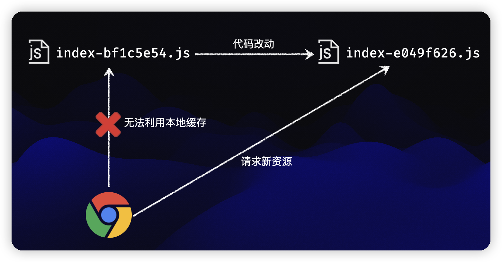
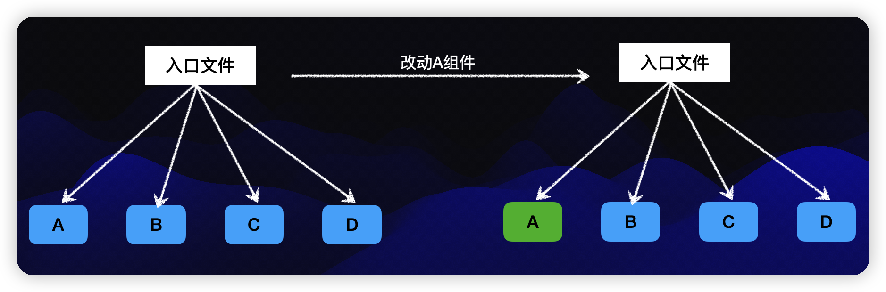
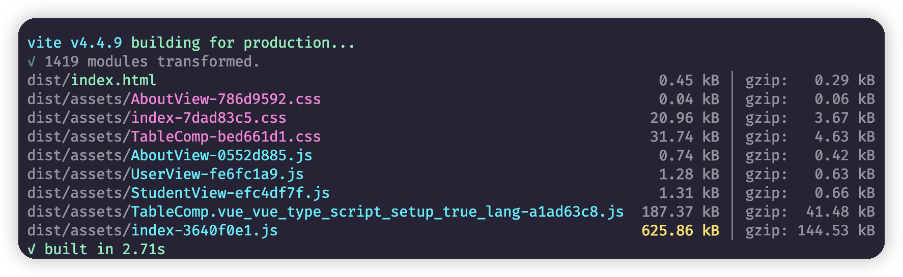
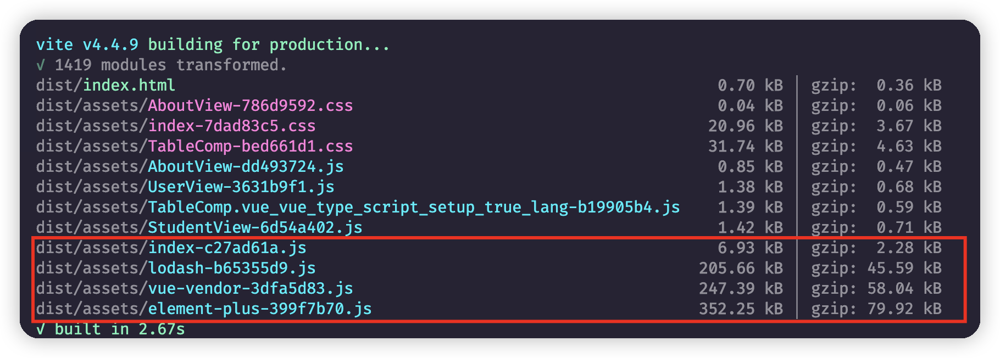
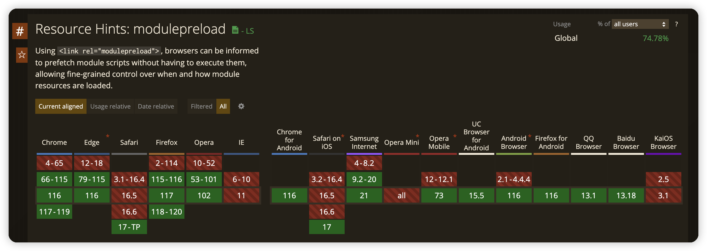
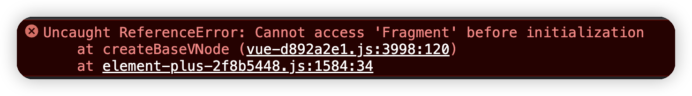

# Code Splitting

打包构建中的代码拆分（Code Splitting）是一种优化技术，它将应用程序的代码拆分成多个小块（chunks），并在需要时按需加载这些代码块。这种技术的目的是提高应用程序的性能和用户体验，主要有以下几个原因：

1. **减少初始加载时间**

   当应用程序的代码被打包成一个单独的文件时，用户在访问应用程序时需要下载整个文件，这可能导致长时间的加载延迟。通过代码拆分，可以将应用程序的关键代码和初始加载所需的最小功能模块放在主文件中，而将其他代码块延迟加载。这样可以减少初始加载时间，使用户更快地看到应用程序的内容。

   

2. **按需加载**

   应用程序通常具有多个页面或功能模块，用户在访问应用程序时并不总是需要加载所有的代码。比较典型的例子就是路由组件。与当前路由无关的组件并不用加载。而项目被打包成单 bundle 之后，无论是`初始化Chunk`还是`异步Chunk(动态import)`，都会打包进同一个产物，也就是说，浏览器加载产物代码的时候，会将两者一起加载，导致许多冗余的加载过程，从而影响页面性能。通过代码拆分，可以将不同页面之间的代码拆分成独立的代码块，并在用户访问相关页面时按需加载相应的代码块。这样可以减少不必要的代码下载和执行，提高页面切换的响应速度。

   

3. **并行加载**

   浏览器在下载资源时有一定的并行限制，即同时下载的资源数量是有限的。通过代码拆分，可以将应用程序的代码拆分成多个小块，使得这些代码块可以并行加载。这样可以充分利用浏览器的并行下载能力，提高资源的加载效率。

   

4. **缓存利用**

   将代码拆分成多个小块后，可以更细粒度地控制缓存策略。相对稳定的代码块可以设置较长的缓存时间，以便在多个页面之间共享缓存。而频繁变更的代码块可以设置较短的缓存时间，以便及时获取最新版本的代码。

   对于线上站点而言，服务端一般在响应资源时加上一些 HTTP 响应头，最常见的响应头之一就是`cache-control`，它可以指定浏览器的**强缓存**，比如设置为下面这样:

   ```javascript
   cache-control: max-age=31536000
   ```

   表示资源过期时间为一年，在过期之前，访问**相同的资源 url**，浏览器直接利用本地的缓存，并不用给服务端发请求，这就大大降低了页面加载的网络开销。不过，在单 chunk 打包模式下面，一旦有一行代码变动，整个 chunk 的 url 地址都会变化

   

由于构建工具一般会根据产物的内容生成哈希值，一旦内容变化就会导致整个 chunk 产物的强缓存失效，所以单 chunk 打包模式下的缓存命中率极低，基本为零。

而进行`Code Splitting`之后，代码的改动只会影响部分的 chunk 哈希改动



在改动 `A` 的代码后，`B`、`C`、`D`的 chunk 产物 url 并没有发生变化，从而可以让浏览器复用本地的强缓存，大大提升线上应用的加载性能。

## 单词解释

- Bundle（捆绑包）

  Bundle 是指将应用程序或模块中的所有代码、样式和资源打包到一个或多个文件中的操作。**一般我们指的是整体的打包产物，包含 JS 和各种静态资源**

- Chunk（代码块）

  Chunk 是指将应用程序的代码按照一定规则拆分成多个小块的操作。这些小块被称为代码块（chunks）。**一般我们指的是打包后的 JS 文件，是 `bundle` 的子集**

- Vendor（供应商）

  在打包构建中，**Vendor 通常指的是第三方库或框架的打包产物，是一种特殊的 chunk。**

## Vite 默认拆包策略

**在生产环境下 Vite 完全利用 Rollup 进行构建，因此拆包也是基于 Rollup 来完成的**。

只不过Rollup专注于JS库的打包，对应用构建的能力还有待提升，Vite 正好是补足了 Rollup 应用构建的能力，在拆包能力这一块的扩展就是很好的体现

**项目的基本结构：**

```javascript
.
├── public
│   ├── vite.svg
├── src
│   ├── routes
│   │			└── index.ts				//路由配置
│   ├── views
│   │			├── AboutView.vue 	// 懒加载路由页面
│   │			├── HomeView.vue		// 直接加载路由页面
│   │			├── PhotoView.vue   // 懒加载路由页面
│   │			├── StudentView.vue // 懒加载路由页面
│   │			└── UserView.vue		// 懒加载路由页面
│   ├── App.vue
│   └── main.ts
└── index.html                
```

**执行打包:**

```javascript
vite v4.4.9 building for production...
✓ 34 modules transformed.
dist/index.html                        0.45 kB │ gzip:  0.29 kB
dist/assets/AboutView-786d9592.css     0.04 kB │ gzip:  0.06 kB
dist/assets/index-d1e7a483.css         0.27 kB │ gzip:  0.17 kB
dist/assets/UserView-18eefd25.js       0.54 kB │ gzip:  0.35 kB
dist/assets/StudentView-85c73246.js    0.55 kB │ gzip:  0.35 kB
dist/assets/AboutView-355cc1df.js      0.74 kB │ gzip:  0.42 kB
dist/assets/index-c0c63fdb.js        216.25 kB │ gzip: 51.48 kB
✓ built in 552ms
```

**打包之后的产物：**

```javascript
.
├── assets
│   ├── AboutView-355cc1df.js   // Async Chunk
│   ├── AboutView-786d9592.css 	// Async Chunk (CSS)
│   ├── index-c0c63fdb.js      	// Initial Chunk
│   ├── index-d1e7a483.css     	// Initial Chunk (CSS)
│   ├── StudentView-85c73246.js // Async Chunk
│   └── UserView-18eefd25.js		// Async Chunk
├── index.html                 	// 入口 HTML
└── vite.svg										// 静态资源
```

这是没有任何配置的vite打包之后的产物，**自动对懒加载的路由和与其对应的css进行的处理**

## 自定义拆包策略

针对更细粒度的拆包，`Vite`还是基于的`Rollup`处理。

```javascript
build: {
  ...
  rollupOptions: {
    output: {
      ...
      manualChunks:{
        ...
      }
    }
	}
}
```

`manualChunks` 主要有两种配置的形式，可以配置为一个对象或者一个函数。

### 对象方式

```javascript
manualChunks: {
  'vue-vendor': ['vue', 'vue-router']
}
```

在对象格式的配置中，`key`代表 chunk 的名称，`value`为一个字符串数组，每一项为第三方包的包名

```javascript
vite v4.4.9 building for production...
✓ 34 modules transformed.
dist/index.html                        0.54 kB │ gzip:  0.33 kB
dist/assets/AboutView-786d9592.css     0.04 kB │ gzip:  0.06 kB
dist/assets/index-d1e7a483.css         0.27 kB │ gzip:  0.17 kB
dist/assets/UserView-9010cdee.js       0.55 kB │ gzip:  0.35 kB
dist/assets/StudentView-eff7d69a.js    0.55 kB │ gzip:  0.35 kB
dist/assets/AboutView-74a57329.js      0.78 kB │ gzip:  0.43 kB
dist/assets/index-4fb9786f.js          5.87 kB │ gzip:  2.06 kB
dist/assets/vue-vendor-99c39a4b.js   210.95 kB │ gzip: 49.67 kB
✓ built in 553ms
```

可以看到之前很大的`index.js`文件被拆分了出来。

如果代码中有其他第三方包，我们可以看的更加明显**(加入了lodash和elementUI，并加入了组件显示Table)**



加入配置进行代码切割

```javascript
build: {
  minify: false,
  rollupOptions: {
    output: {
      manualChunks: {
        'vue-vendor': ['vue', 'vue-router'],
        'element-plus': ['element-plus'],
        'lodash': ['lodash-es'],
      },
    }
  }
}
```



### 预加载指令生成

Vite 会为入口 chunk 和它们在打包出的 HTML 中的直接引入自动生成 `<link rel="modulepreload">` 指令。

`modulepreload`其实就是对于原生 ESM 模块的`Preload`，也就是说，对于一般的模块，我们可以使用`Preload`进行预加载，对于ESM模块，可以使用`modulepreload`

```javascript
<link rel="preload" href="main.js" as="script">
<link rel="modulepreload" crossorigin href="/assets/vue-vendor-3dfa5d83.js">
```

不过`modulepreload`的浏览器兼容性并不是太好,仅仅只有74%



不过在 Vite 中我们可以通过配置一键开启 `modulepreload` 的 Polyfill

```javascript
build: {
  polyfillModulePreload: true
}
```

### 异步 Chunk 加载优化

在实际项目中，Rollup 通常会生成 “共用” chunk —— 被两个或以上的其他 chunk 共享的 chunk。与动态导入相结合，会很容易出现下面这种场景：


在无优化的情境下，当异步 chunk `A` 被导入时，浏览器将必须请求和解析 `A`，然后它才能弄清楚它也需要共用 chunk `C`。这会导致额外的网络往返：

```
Entry ---> A ---> C
```

Vite 将使用一个预加载步骤自动重写代码，来分割动态导入调用，以实现当 `A` 被请求时，`C` 也将 **同时** 被请求：

```
Entry ---> (A + C)
```

`C` 也可能有更深的导入，在未优化的场景中，这会导致更多的网络往返。Vite 的优化会跟踪所有的直接导入，无论导入的深度如何，都能够完全消除不必要的往返。


### 函数方式

```javascript
manualChunks(id) {
  if (id.includes('node_modules/vue')) {
    return 'vue';
  }
  if (id.includes('element-plus')) {
    return 'element-plus';
  }
  if (id.includes('lodash-es')) {
    return 'lodash';
  }
}
```

看上去好像各个第三方包的 chunk (如`lodash`、`react`等等)都能拆分出来，但实际上你可以运行 `npm run preview` 预览产物，会发现产物根本没有办法运行起来，页面出现白屏，同时控制台出现如下的报错:



这也就是函数配置的坑点所在了，虽然灵活而方便，但稍不注意就陷入此类的产物错误问题当中。

至于为什么报这个错误，我们换个简单点的例子大家就能看出来了

### 循环引用问题

```javascript
// a.js
import { funcB } from './b.js';

funcB();

export const funcA = () => {
  console.log('a');
} 
```

```javascript
// b.js
import { funcA } from './a.js';

funcA();

export const funcB = () => {
  console.log('b')
}
```

```javascript
// index.html
<!DOCTYPE html>
<html lang="en">
<head>
  <meta charset="UTF-8">
  <meta name="viewport" content="width=device-width, initial-scale=1.0">
  <title>Document</title>
</head>
<body>
  <script type="module" src="/a.js"></script>
</body>
</html>
```

结果出现类似的错误:


- 执行 `a.js` 时，发现引入了 `b.js`，于是去执行 `b.js`
- 执行`b.js`，发现里面引入了`a.js`(出现循环引用)，认为`a.js`已经加载完成，继续往下执行
- 执行到`funcA()`语句时发现 funcA 并没有初始化，于是报错。

当然，出现这种问题的原因，主要是 `manualChunks`逻辑过于简单，仅仅通过路径 id 来决定打包到哪个 chunk 中，而漏掉了间接依赖的情况。我们当然可以在函数中做出处理，但是这个过程太过于繁琐，现阶段还是建议大家要么使用简单的对象处理。要么直接使用插件来处理循环引用的问题

[vite-plugin-chunk-split](https://github.com/sanyuan0704/vite-plugin-chunk-split) 是一个 Vite 插件，支持多种拆包策略，可避免手动操作`manualChunks`潜在的循环依赖问题。

不过现阶段这个插件有个问题是，作者还没有更新到支持Vite4(其实主要是Rollup3)，导入插件之后会报出对等依赖（`peerDependencies`）的错误，但是使用上还没有发现大问题，但是并没有严谨测试，慎用!

**安装**

```javascript
pnpm i vite-plugin-chunk-split -D
```

**使用**

```javascript
// vite.config.ts
import { chunkSplitPlugin } from 'vite-plugin-chunk-split';

export default defineConfig({
  plugins: [
    vue(),
    AutoImport({
      resolvers: [ElementPlusResolver()],
    }),
    Components({
      resolvers: [ElementPlusResolver()],
    }),
    chunkSplitPlugin({
      // 指定拆包策略
      customSplitting: {
        'vue-vendor': ['vue', 'vue-router'],
        'element-plus': ['element-plus'],
        // 支持正则表达式。src 中 components 下的所有文件被会被打包为`component-util`的 chunk 中
        'components-util': [/src\/components/]
      }
    })
  ],
})

```

