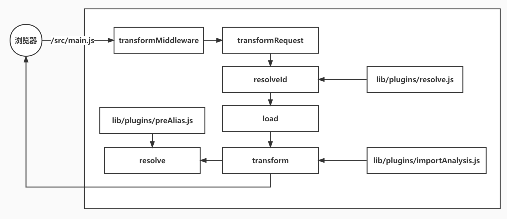

# 实现思路

## 实现命令行

## 实现 http 服务器

## 实现静态文件中间件

## 预构建

1.在项目启动前分析依赖,找到三方包的依赖,然后进行预打包到node_modules/.vite/vue.js
2.在返回main.js的时候,找到vue,替换成/node_modules/.vite/vue.js
3.在客户端请求/node_modules/.vite/vue.js的时候,需要返回对应的内容

### 分析第三方依赖

### 预编译并保存 metadata

### 修改导入路径

```
修改返回的 main.js 中的 vue 的路径

import { createApp } from 'vue' 变为
import { createApp } from '/node_modules/.vite/deps/vue.js'
请求/src/main.js,此请求先由transformMiddleware中间件处理，通过isJSRequest判断是 js 请求,走transformRequest

在transformRequest里执行pluginContainer.resolveId(url)方法,方法内会由resolvePlugin返回/src/main.js的绝对路径
再调用pluginContainer.load(id)方法返回 JS 文件内容,此处返回null
再调用pluginContainer.transform(code, id)方法,执行importAnalysisPlugin里的transform方法,里面会分析依赖的模块，获取依赖的vue,重新执行PluginContext.resolve,执行preAliasPlugin,获取vue相对路径/node_modules/.vite/deps/vue.js,把vue变为/node_modules/.vite/deps/vue.js
```



## 支持 vue 插件

## 支持 style

## 支持环境变量

## HMR
